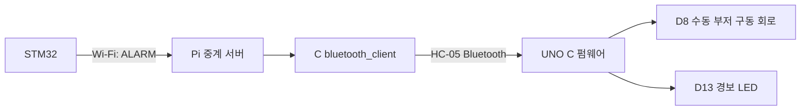

# 관리실 Arduino 부저 경보



sql_client의 카드·CDS DB 처리는 그대로 유지합니다. 경보는 DB를 거치지 않습니다.

## 동작

- STM32: 서보 LOCK이고 CDS 판정 OPEN이 1초 이상 유지되면 ACTIVE.
- 서보 UNLOCK 또는 CDS CLOSED 확인 시 CLEAR.
- 경보 상태는 변경 시 전송하고, 5초 간격으로 재전송합니다.
- Pi 서버는 보관함 ID별 마지막 경보를 기억하고 Bluetooth 클라이언트 재접속 시 전달합니다.
- Arduino는 16개 보관함을 구분합니다. 하나라도 ACTIVE면 부저·D13 LED 작동.
- CLEAR를 받아야 해당 보관함 경보가 해제됩니다. 연결이 끊겼다는 이유만으로 부저를 끄지 않습니다.
- 부저: 수동형 기준 2kHz, 0.5초 ON / 0.5초 OFF 반복.
- MCU 수신 오류·버퍼 초과가 발생하면 경보 상태로 유지합니다. 원인 해결 후 UNO를 리셋하세요.

CDS는 밝기로 문을 추정합니다. 잠긴 상태에서 센서를 밝게 노출하면 경보가 발생할 수 있습니다.
실제 설치 후 내부 LED 및 주변 조명 변화에 따른 오경보를 확인하세요.
서버의 ALARM@RECEIVED는 서버 수신 확인입니다. Arduino acknowledgement 로그는 UNO가 메시지를 처리했다는 확인입니다.
물리적으로 부저가 소리를 내는지는 별도 확인해야 합니다.

## UNO + HC-05 배선

| 연결 | 위치 |
| --- | --- |
| HC-05 TXD | UNO D0 / RX |
| UNO D1 / TX | 전압 분배/레벨 변환 후 HC-05 RXD |
| HC-05 GND | UNO GND |
| HC-05 VCC | 실제 보드 정격 전원. 5V 입력을 지원하는 레귤레이터 포함 보드만 5V 사용 |
| 수동 부저 구동 회로 입력 | UNO D8 |
| 경보 LED | UNO 내장 D13 LED |

HC-05 RXD는 3.3V 로직입니다. D1의 5V 출력을 직접 연결하지 마세요.
전압 분배 예: D1 → 1kΩ → HC-05 RXD, RXD → 2kΩ → GND.
부저는 정격 전원과 적절한 트랜지스터 구동 회로를 사용하고 GND를 UNO와 공통 연결합니다.
부저 소비 전류와 정격 전압을 확인하기 전에는 GPIO에 직접 연결하지 않습니다.
현재 HC-05 데이터 UART 설정은 9600 baud, 8N1이어야 합니다.
UNO 업로드 중에는 HC-05의 D0/D1 연결을 분리하고 업로드 후 복구하세요.

## UNO 순수 C 펌웨어

모든 로직은 arduino/alarm_monitor/main.c와 alarm_state.c입니다. Arduino C++ 스케치는 사용하지 않습니다.
Linux에서 AVR 도구를 설치하고 프로젝트 폴더 구조를 유지해 빌드합니다.

```sh
sudo apt install gcc-avr avr-libc avrdude make
cd arduino/alarm_monitor
make
```

수동형 기본 설정은 BUZZER_ACTIVE=0입니다. 능동형으로 바꾸려면 make BUZZER_ACTIVE=1을 사용합니다.
동일 파일을 다른 설정으로 다시 빌드할 때는 아래 명령으로 ELF/HEX를 직접 재생성할 수 있습니다.

```sh
avr-gcc -std=c11 -Os -Wall -Wextra -mmcu=atmega328p -DF_CPU=16000000UL \
  -DBUZZER_ACTIVE=0 -I../../tools main.c alarm_state.c -o alarm_monitor.elf
avr-objcopy -O ihex -R .eeprom alarm_monitor.elf alarm_monitor.hex
```

생성한 HEX를 UNO에 업로드합니다. 포트는 실제 장치로 바꾸세요.

```sh
avrdude -p m328p -c arduino -P /dev/ttyACM0 -b 115200 -D -U flash:w:alarm_monitor.hex:i
```

## Pi Bluetooth 연결

Pi에서 HC-05를 검색·페어링합니다. MAC은 실제 검색 결과로 바꿉니다.

```sh
sudo apt install bluez
bluetoothctl
```

bluetoothctl 안에서 한 줄씩 실행합니다.

```text
power on
agent KeyboardOnly
default-agent
scan on
pair XX:XX:XX:XX:XX:XX
trust XX:XX:XX:XX:XX:XX
scan off
quit
```

PIN이 요청되면 모듈에 설정된 PIN을 입력합니다. RFCOMM 장치를 바인딩합니다.

```sh
sudo rfcomm bind 0 XX:XX:XX:XX:XX:XX 1
```

## Pi 세 프로그램 실행

최신 tools/wifi_test_server.c, bluetooth_client.c, rental_protocol.h를 Pi에 복사합니다.
기존 서버를 Ctrl+C로 종료하고 재컴파일합니다. sql_client와 DB 테이블은 수정하지 않습니다.

```sh
gcc -std=c11 -Wall -Wextra -O2 wifi_test_server.c -o wifi_test_server
gcc -std=c11 -Wall -Wextra -O2 bluetooth_client.c -o bluetooth_client
```

터미널 1에서 중계 서버:

```sh
./wifi_test_server --port 5000
```

터미널 2에서 기존 sql_client(DB_PASSWORD 설정 후):

```sh
./sql_client 127.0.0.1 5000 SQL_CLIENT
```

터미널 3에서 Bluetooth 중계:

```sh
sudo ./bluetooth_client 127.0.0.1 5000 /dev/rfcomm0
```

최신 STM32 펌웨어도 다운로드합니다.
관리실 연결이 없으면 서버가 마지막 경보를 메모리에 보관하고 재접속 시 전달합니다.
Pi 서버 자체를 재시작하면 캐시는 초기화되고 STM32의 다음 상태 재전송으로 복구됩니다.

## 시험

1. 센서를 가려 CLOSED, 서보 LOCK 상태를 확인합니다.
2. 카드 승인 없이 센서를 밝게 노출합니다.
3. STM32의 ALARM ACTIVE, Pi의 HC-05 TX, Arduino 부저와 D13 LED를 확인합니다.
4. 센서를 다시 가려 CLOSED가 되면 CLEAR와 부저 정지를 확인합니다.
5. 승인으로 UNLOCK 상태에서 센서를 밝게 노출하면 경보가 발생하지 않아야 합니다.

실제 Bluetooth·Arduino·부저 장비의 동작은 사용 환경에서 확인해야 합니다.
PC 검증은 C 중계 테스트, 모의 시리얼 전송, 경보 상태 로직 및 AVR 크로스 빌드까지입니다.

## 재부팅 후 부저가 작동하지 않을 때

카드와 CDS DB 저장은 정상인데 Bridge disconnected가 반복되면 Bluetooth 터미널을 확인합니다.
최신 bluetooth_client.c는 끊긴 경로를 Relay TCP 또는 HC-05 RFCOMM으로 표시합니다.
HC-05 queued는 전송 대기, HC-05 wrote는 OS 시리얼 쓰기 완료,
Arduino RX: ...ACK...는 UNO 프로그램의 처리 확인입니다. 물리적 소리 확인은 별도입니다.

Bluetooth 중계를 Ctrl+C로 종료하고, Pi의 일반 터미널에서 연결 상태를 확인합니다.

```sh
rfcomm -a
bluetoothctl info 98:DA:60:01:A6:2E
```

현재 사용 중인 bt20 주소는 98:DA:60:01:A6:2E입니다.
재부팅 후 장치 바인딩이 없거나 잘못된 주소라면 중계가 종료된 상태에서 다시 바인딩합니다.

```sh
sudo rfcomm release 0
sudo rfcomm bind 0 98:DA:60:01:A6:2E 1
gcc -std=c11 -Wall -Wextra -O2 bluetooth_client.c -o bluetooth_client
sudo ./bluetooth_client 127.0.0.1 5000 /dev/rfcomm0
```

release에서 장치가 없다는 메시지가 나오면 다음 bind 단계로 진행합니다.
정확한 원인은 새 [BRIDGE] 오류 로그와 rfcomm/Paired/Connected 상태로 구분합니다.

자료: [BlueZ rfcomm](https://github.com/bluez/bluez/wiki/rfcomm),
[BlueZ bluetoothctl](https://github.com/bluez/bluez/blob/master/doc/bluetoothctl.rst),
[HC-05 제조사 자료](https://usermanual.wiki/Document/HC05UserManual.593762476.pdf).
